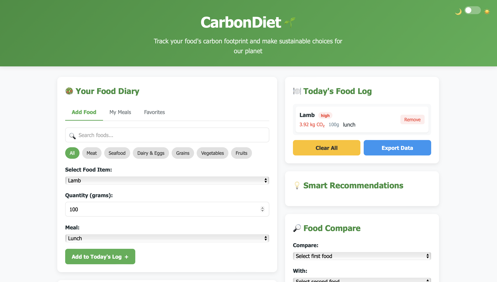

**CarbonDiet** is a lightweight web app that helps users track the carbon footprint of their food and make more sustainable choices for the planet.

---

## 🌍 Purpose

The goal of this project is to:
- Raise awareness about food-related CO₂ emissions
- Help users log their meals and see the environmental impact
- Suggest more eco-friendly alternatives

---

## ⚙️ How to Run

No installation needed. Just open the HTML file in your browser:

1. Clone or download the repository
2. Open `index.html` in your preferred browser
3. That's it! You can now add foods and track emissions

You can also use the **"Run and Debug"** feature in VS Code:
- Open the folder in VS Code
- Right-click on `index.html` and choose **"Open with Live Server"** *(if installed)*
- Or press `F5` to start debugging in a browser (with proper launch config)

---

## 📁 Project Structure

CarbonDiet/
├── index.html # Main HTML file
├── style.css # All styling
└── script.js # App logic (adding, removing food, CO₂ calculation)

---

## 💡 Features

- Add food items with quantity and meal type
- View total CO₂ impact for the day
- Tag foods by emission level: High / Medium / Low
- Export and clear food log
- Smart recommendations and food comparison (optional/future)

---

## 🚀 To-Do / Future Ideas

- Save food logs to local storage
- Support for daily/weekly tracking
- Connect to real food databases (Open Food Facts, USDA)
- Responsive design for mobile
- User accounts and cloud sync

---

## 📄 License

This project is open source under the [MIT License](LICENSE).